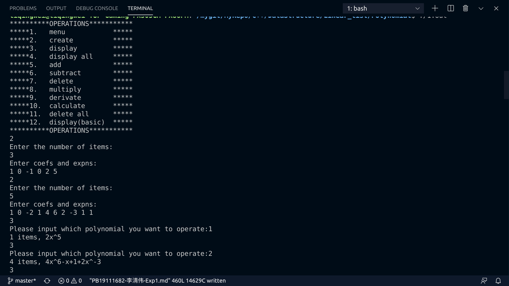
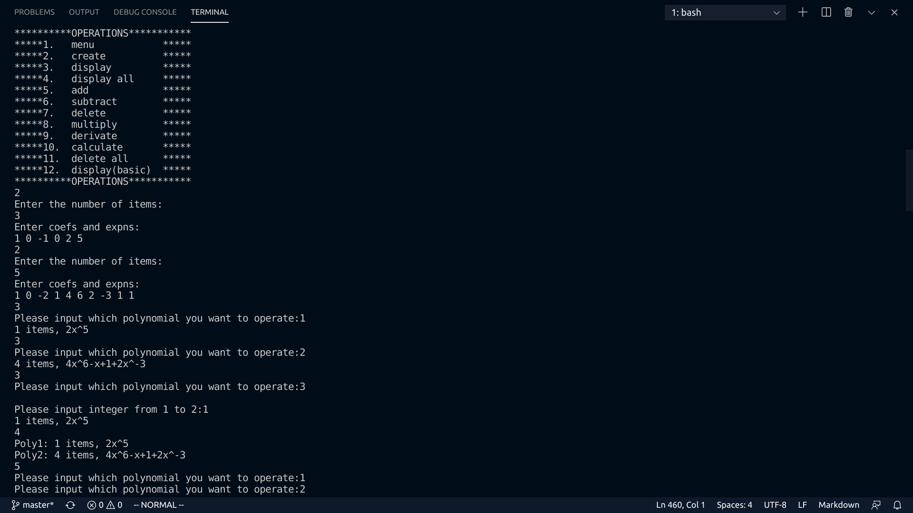
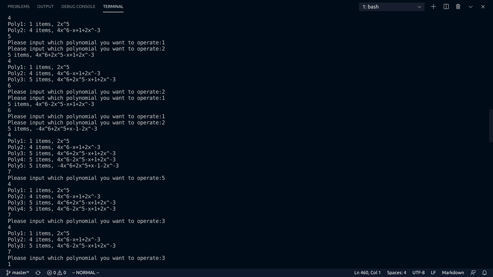
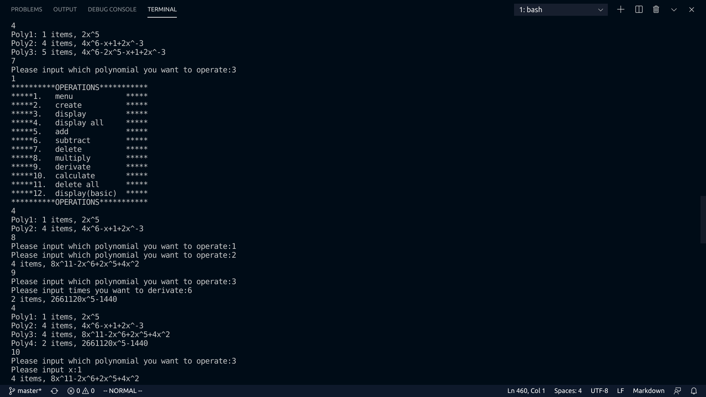
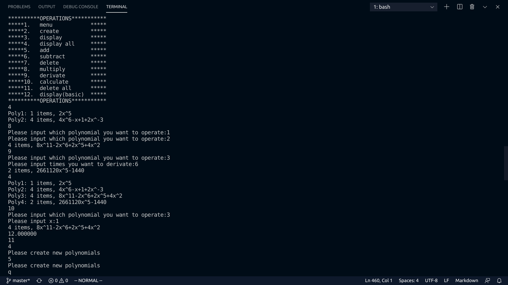

<center><font size=8>一元稀疏多项式计算器</font></center>

### 实验要求

#### 具体要求
1. 用带头结点的单链表存储多项式,实现一个简单的一元稀疏多项式计算器。
2. 一个命令行菜单,如

```
**********OPERATIONS***********
*****1.menu               *****
*****2.create             *****
*****3.display            *****
*****4.display all        *****
*****5.add                *****
*****6.sub                *****
*****7.delete             *****
*****8.mul                *****
*****9.calculate          *****
*****10. derivative       *****
*****11. optimized dis    *****
**********OPERATIONS***********
```
3. 输入并建立多项式。输入格式:n,c1,e1,c2,e2,...,cn,en。其中n是输入的项数,ci、ei分别是第i项的系数和指数,ei可能等于ej,注意合并同类项。ci为实数,ei为整数。可以用一个数组polynomials保存所有创建的多项式的头节点.
4. 输出多项式。输入格式:i。i表示输出polynomials[i]指向的多项式。输出形式为:n,c1,e1,c2,e2,...其中n为多项式的项数,ci,ei分别为第i项的系数和指数,输出序列按指数降序。输出的多项式应为最简形式,应合并同类型,删除系数为0的项。若多项式为0则输出1 0 0.
5. 输出当前存储的所有多项式。
6. 多项式加法。输入格式:i j 其中i表示polynomials[i]指向的多项式。创建一个新的多项式作为结果,并输出。输出格式同3。
7. 多项式减法,同5.
8. 删除多项式。输入格式:i。i表示删除第i个多项式。需要释放掉该多项式的空间,并类似于顺序表的删除,polynomials[i+1]存入polynomials[i],polynomials[i+2]存入polynomials[i+1]...
9. 乘法。输入格式 : i j 。表示 polynomials[i]*polynomials[j] 。创建一个新的多项式作为结果,并输出。
10. 求值或者求导
11. 优化输出格式

#### 输入输出格式

```
// 输入
1 // 执行加法操作
3 // 链表 1 共有 3 项
2 0 // 常数项是 2
4 3 // 4x^3
5 2 // 5x^2
3 // 链表 2 共有 3 项3 0 // 常数项是 2
5 3 // 5x^3
4 2 // 4x^2
// 输出
2 // 结果链表共有 2 项
5 0 // 常数项是 5
4 6 // 4x^6
// 按照次数大小升序排列
```

### 设计思路

1.  设计LinkList链表模板类，该模板类可以：
```c++
    void PrintList();                                        
    //  打印链表

    LinkList();                                              
    //  构造空线性链表

    ~LinkList();                                             
    //  销毁链表

    void ClearList(void);                                    
    //  将链表重置为空

    void InsFirst(LNode<Type> *ins);                         
    //  将ins插入头结点之后

    LNode<Type> *DelFirst(void);                             
    //  删除第一个结点并返回指针

    void Append(LNode<Type> *s);                             
    //  将s所指的一串结点链接到尾结点后

    LNode<Type> *Remove(void);                               
    //  删除尾结点并返回

    void InsBefore(LNode<Type> *p, LNode<Type> *s);          
    //  p为链表中已知结点，s要插入p前面，p指向新插入的结点

    void InsAfter(LNode<Type> *p, LNode<Type> *s);           
    //  p为链表中已知结点，s要插入p后面，p指向新插入的结点

    void SetCurElem(LNode<Type> *p, Type e);                 
    //  p为链表中已知结点，用e更新p的data

    Type GetCurElem(LNode<Type> *p);                         
    //  p为链表中已知结点，返回p->data

    bool ListEmpty(void);                                    
    //  返回链表是否为空，空true

    int ListLength(void);                                    
    //  返回链表长度

    LNode<Type> *GetHead(void);                              
    //  返回头结点位置

    LNode<Type> *GetTail(void);                              
    //  返回尾结点位置

    LNode<Type> *PriorPos(LNode<Type> *p);                   
    //  返回p直接前驱的位置, nullptr之前设为tail

    LNode<Type> *NextPos(LNode<Type> *p);                    
    //  返回p直接后驱的位置

    bool LocatePos(int i, LNode<Type> *&p);                  
    //  用p返回第i个结点的位置,返回true; 若i不合法，返回false, p = nullptr

    bool GetElem(const int i, Type &e);                      
    //  返回第i个结点的data

    LNode<Type> *LocateElem(const Type e, int (*compare)(const Type a, const Type b)); 
    //  返回与e匹配的结点位置，若不匹配，返回nullptr

    bool ListTraverse(bool (*visit)());

```

2.  设计数据结构Polynomial类为LinkList链表模板类的一个子类，这个Polynomial类可以：
```c++
    Polynomial(void);                                 
    //  初始化

    Polynomial(const Polynomial &a);                  
    //  复制构造函数

    void PrintPolyn();                                
    //  优化方式打印多项式

    void PrintPolyn_basic();                          
    //  基础打印

    int PolynLength();                                
    //  求多项式项数

    Polynomial operator+(const Polynomial &b);        
    //  两个多项式做加法

    Polynomial operator-(const Polynomial &b);        
    //  两个多项式做减法

    friend Polynomial operator-(const Polynomial &b); 
    //  多项式取反

    Polynomial operator*(const Polynomial &b);        
    //  两个多项式做乘法

    Polynomial operator=(const Polynomial &b);        
    //  赋值

    Polynomial derivate(int n);                       
    //  n阶导

    LNode<Item> *ListInsert(LNode<Item> e);           
    //  复制新的e按照多项式指数降序的顺序插入，返回插入的指针，若e的系数为0，则不插入

    void Input(void);                                 
    //  输入多项式

    double calculate(double x);                       
    //  代x计算

```
3. 设计应用程序使用Polynomial类
    1.  创建多项式数组
    2.  进入用户交互函数input_ch()
    3.  对多项式数组调用相应方法进行相应操作

### 关键代码讲解

Polynomial.h
* ``ListInsert()``在多项式中插入不是0的单项，不顾最终结果如何
```c++
LNode<Item> *Polynomial::ListInsert(LNode<Item> e)
{
    if (fabs(e.data.coef) < 0.00001)    //  如果e的系数为0，则不插入
        return nullptr;
    LNode<Item> *p = nullptr;
    LNode<Item> *insert = new LNode<Item>;
    insert->data.coef = e.data.coef;
    insert->data.expn = e.data.expn;    //  new一块空间，防止被自动清理内存
    p = LocateElem(e.data, cmp_expn_larger);    
    //  通过LinkList的LocateElem方法找到合适的位置插入

    if (p != nullptr)   //  表示p指数小于等于e的指数
    {
        if (p->data.expn == e.data.expn)    //  表示p指数等于e的指数
        {
            delete insert;  //  及时释放insert，因为没用
            p->data.coef += e.data.coef;    //  加入系数
            return p;
        }
    }
    LNode<Item> *p_pripr = PriorPos(p); //  找到p应该插入位置的前面一个节点
    LNode<Item> *s = p_pripr->next; //  下面为插入该节点
    p_pripr->next = insert;
    insert->next = s;
    if (insert->next == nullptr)    //  在最后插入要改变tail
        tail = insert;
    len++;
    return insert;
}
```
* ``operator+()``重载方法会遍历两个多项式并重新记录到c中
```c++
Polynomial Polynomial::operator+(const Polynomial &b)
{
    LNode<Item> *pa = head->next;
    LNode<Item> *pb = b.head->next;
    Polynomial c;   //  创建新的链表
    while (pa != nullptr && pb != nullptr)  //  遍历两个链表
    {
        if (pa->data.expn > pb->data.expn)  //  pa指数更大，插入c
        {
            c.ListInsert(*pa);  //  这里可以防止pa中的系数为0的项插入到c中
            pa = pa->next;
        }
        else if (pa->data.expn < pb->data.expn)
        {
            c.ListInsert(*pb);
            pb = pb->next;
        }
        else    //  pa，pb指数相同
        {
            LNode<Item> temp;
            temp.data.coef = pa->data.coef + pb->data.coef;
            temp.data.expn = pa->data.expn;
            c.ListInsert(temp);
            pa = pa->next;
            pb = pb->next;
        }
    }
    if (pb != nullptr)  //  pb未完全部插入
    {
        while (pb != nullptr)
        {
            LNode<Item> *temp = pb;
            c.ListInsert(*pb);
            pb = pb->next;
        }
    }
    if (pa != nullptr)
    {
        while (pa != nullptr)
        {
            LNode<Item> *temp = pa;
            c.ListInsert(*pa);
            pa = pa->next;
        }
    }
    return c;
}
```
* ``operator-()``方法对多项式进行取反
```c++
Polynomial operator-(const Polynomial &b)
{
    Polynomial c; 
    LNode<Item> *p = b.head->next;
    while (p != nullptr)
    {
        Polynomial temp = Polynomial();
        temp.ListInsert(LNode<Item>({-p->data.coef, p->data.expn}));    //  插入系数取反项
        c = c + temp;   //  将temp多项式与c相加
        p = p->next;
    }
    return c;
}
```
* ``operator-()``二元运算符``-``对减数进行取反再调用加法

```c++
Polynomial Polynomial::operator-(const Polynomial &b)
{
    return (*this) + (-b);
}
```
* ``operator*()``对两个多项式的分别遍历，配对系数相乘，指数相加，加入新多项式c

```c++
Polynomial Polynomial::operator*(const Polynomial &b)
{
    Polynomial c; 
    LNode<Item> *pa = head->next;
    while (pa != nullptr)   //  pa外层遍历
    {
        LNode<Item> *pb = b.head->next;
        while (pb != nullptr)   //  pb内层遍历
        {
            Polynomial temp = Polynomial();
            temp.ListInsert(LNode<Item>({pb->data.coef * pa->data.coef, pa->data.expn + pb->data.expn}));
            c = c + temp;
            pb = pb->next;
        }
        pa = pa->next;
    }
    return c;
}
```
* ``derivate()``函数求n阶导，采用递归方式

```c++
Polynomial Polynomial::derivate(int n)
{
    if (n != 1)
    {
        return this->derivate(n - 1).derivate(1);   //  假设得到了n-1阶导的结果，返回再求一次导，即n阶导的结果
    }

    Polynomial c; 

    LNode<Item> *p = head->next;
    while (p != nullptr)
    {
        Polynomial temp = Polynomial();
        temp.ListInsert(LNode<Item>({p->data.coef * p->data.expn, p->data.expn - 1}));  //  多项式求导公式
        c = c + temp;
        p = p->next;
    }
    return c;
}
```
* ``calculate()``只接受多项式指数为正整数的计算
```c++
double Polynomial::calculate(double x)
{
    double sum = 0, temp = 1;

    LNode<Item> *p = head->next;
    while (p != nullptr)
    {
        temp = 1;
        for (int i = 0; i < p->data.expn; i++)
        {
            temp *= x;
        }
        sum += temp * p->data.coef;
        p = p->next;
    }
    return sum;
}
```
* ``PrintPolyn()``打印多项式

```c++
void Polynomial::PrintPolyn()
{
    PolynLength();
    if (len == 0)   //  0
    {
        printf("1 items, ");
        printf("0\n");
        return;
    }

    printf("%d items, ", len);
    LNode<Item> *p = head->next;
    while (p != nullptr)
    {
        if (p->data.coef > 0 && p != head->next)    //  不是第一项，正数
        {
            if (fabs(p->data.coef - 1) < 0.0001)    //  系数为1
            {
                if (p->data.expn == 1)  //  +x
                    printf("+x");
                else if (p->data.expn == 0) //  +1
                    printf("+1");
                else
                    printf("+x^%d", p->data.expn);  //  +x^expn
            }
            else if (fabs(p->data.coef - int(p->data.coef)) < 0.0001)   // 正整数
            {
                if (p->data.expn == 1)  //  +cx
                    printf("+%dx", int(p->data.coef));
                else if (p->data.expn == 0) //  +c
                    printf("+%d", int(p->data.coef));
                else    //  +cx^expn
                    printf("+%dx^%d", int(p->data.coef), p->data.expn);
            }
            else    // 正小数
            {
                if (p->data.expn == 0)  // +2.33333
                    printf("+%.2lf", p->data.coef);
                else if (p->data.expn == 1) //  +2.33333x
                    printf("+%.2lfx", p->data.coef);
                else    // +2.33333x^expn
                    printf("+%.2lfx^%d", p->data.coef, p->data.expn);
            }
        }
        else if (p->data.coef < 0)  //  负数
        {
            if (fabs(p->data.coef + 1) < 0.0001)    //  -1
                if (p->data.expn == 1)  //  -x
                    printf("-x");
                else if (p->data.expn == 0) //  -1
                    printf("-1");
                else    //  -x^expn
                    printf("-x^%d", p->data.expn);
            else if (fabs(p->data.coef - int(p->data.coef)) < 0.0001)   //  负整数
                if (p->data.expn == 1)  //  -2x
                    printf("%dx", int(p->data.coef));
                else if (p->data.expn == 0) //  -2
                    printf("%d", int(p->data.coef));
                else    //  -2x^expn
                    printf("%dx^%d", int(p->data.coef), p->data.expn);
            else    //  负小数
            {
                if (p->data.expn == 1)  //  -2.333x
                    printf("%.2lfx", p->data.coef);
                else if (p->data.expn == 0) //  -2.333
                    printf("%.2lf", p->data.coef);
                else    // -2.333x^expn
                    printf("%.2lfx^%d", p->data.coef, p->data.expn);
            }
        }
        else    //  正数，还是首项，不能显示正号
        {
            if (fabs(p->data.coef - 1) < 0.0001)    // 1
            {
                if (p->data.expn == 1)  //x
                    printf("x");
                else if (p->data.expn == 0) //1
                    printf("1");
                else
                    printf("x^%d", p->data.expn);   // x^expn
            }
            else if (fabs(p->data.coef - int(p->data.coef)) < 0.0001)   //  正整数
                if (p->data.expn == 1)  //  cx
                    printf("%dx", int(p->data.coef));
                else if (p->data.expn == 0) //c
                    printf("%d", int(p->data.coef));
                else    // cx^expn
                    printf("%dx^%d", int(p->data.coef), p->data.expn);
            else    //  小数
            {
                if (p->data.expn == 0)
                    printf("%.2lf", p->data.coef);
                else if (p->data.expn == 1)
                    printf("%.2lfx", p->data.coef);
                else
                    printf("%.2lfx^%d", p->data.coef, p->data.expn);
            }
        }
        p = p->next;
    }
    putchar('\n');
}
```
* ``Input()``

```c++
void Polynomial::Input(void)
{
    printf("Enter the number of items:\n");
    int n_in = 0;
    scanf("%d", &n_in);

    printf("Enter coefs and expns:\n");
    for (int i = 0; i < n_in; i++)
    {
        double coef_in = 0;
        int expn_in = 0;
        scanf("%lf%d", &coef_in, &expn_in);
        Polynomial b = Polynomial();
        b.ListInsert(LNode<Item>({coef_in, expn_in}));  //  将项插入b作为一个多项式进行运算
        *this = *this + b;  //  将b加到*this上可以去b中的0
    }
}
```
***
1.cpp
* ``input_ni()``检查输入多项式下标是否溢出
```c++
int input_ni(void)
{
    int ni = 0;
    printf("Please input which polynomial you want to operate:");
    while (scanf("%d", &ni) == 0 || !(ni >= 1 && ni <= num_polyn))
    {
        printf("\nPlease input integer from %d to %d:", 1, num_polyn);
    }
    return ni - 1;
}
```

* ``is_num_0``判断当前多项式组个数是否为0
```c++
bool is_num_0(void)
{
    if (num_polyn == 0)
    {
        printf("Please create new polynomials\n");
        return true;
    }
    return false;
}
```

### 调试分析

1. Polynomial.h
   1. ``Polynomial(void)`` - ``O(1)``，初始化
   2. ``Polynomial(const Polynomial &a)`` - ``O(n)``，对每个数据进行复制
   3. ``void Polynomial::PrintPolyn()`` - ``O(n)``，对每个节点进行打印
   4. ``int Polynomial::PolynLength()`` - ``O(n)``，遍历整个多项式链表
   5. ``LNode<Item> *Polynomial::ListInsert(LNode<Item> e)``-``O(2*n)``，确定节点插入的位置大致需要``O(n)``，确定p的前一个节点位置大致需要``O(n)``
   6. ``Polynomial Polynomial::operator+(const Polynomial &b)``
      1. 设pa，pb链表长分别为$L_a, L_b$
      2. 如果pa，pb多项式指数基本没有相同，则大致需要$O((L_a+L_b+1)(L_a+L_b))$时间，若基本相同，则只需要$O(L_a(L_a+1))$时间
      3. 还有返回函数时的复制构造函数$O(L_a)$
      4. 所以大致需要$O(\frac{L_a^2+(L_a+L_b)^2}{2}+L_a)$
   7. ``Polynomial operator-(const Polynomial &b)``-``O(n(n+1)+n)``，遍历整个多项式然后取反重新生成新多项式，在生成过程中使用``ListInsert``，每次插入都要2i个单位时间，因此和为$n(n+1)$，返回时还有复制构造函数
   8. ``Polynomial Polynomial::operator-(const Polynomial &b)``
      1. 先用取反，$O(L_b(L_b+1))$
      2. 在相加,$O(\frac{L_a^2+(L_a+L_b)^2}{2})$
      3. 返回时复制构造函数,$O(L_a)$
      4. 大致时间复杂度为三者相加
   9. ``Polynomial Polynomial::operator*(const Polynomial &b)``
      1. 对于pa每个节点，都要遍历pb，还要插入,$O(L_a\times L_b\times (L_a\times L_b)/2)$
   10. ``Polynomial Polynomial::operator=(const Polynomial &b)``-``O(n)``，遍历多项式链表
   11. ``Polynomial Polynomial::derivate(int n)``-$O(L_an)$, n为n阶导
   12. ``double Polynomial::calculate(double x)``-``O(n)``,每项计算

### 代码测试










### 实验总结

学会使用ADT的方式编写程序，通过对数据结构的方法的编写以及封装，将数据结构与应用层脱离，方便更好地修改，适用更广的范围

学习编写了链表的相关操作和方法，熟悉了链表的使用

### 附录
1. LinkList.h   链表相关操作
2. Polynomial.h Polynomial类
3. 1.cpp    使用Polynomial类，实现计算器
