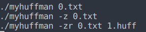
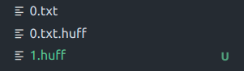
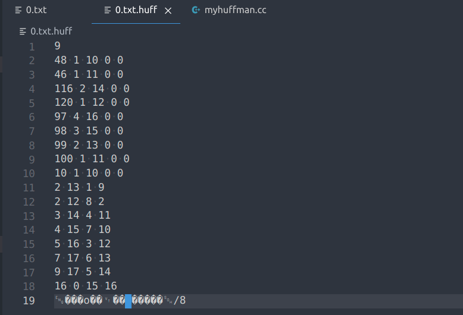
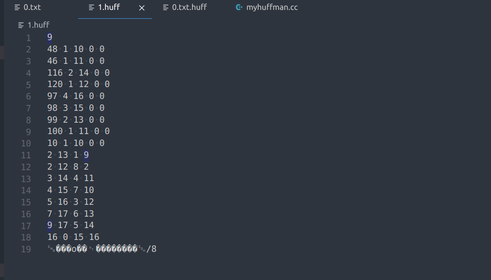
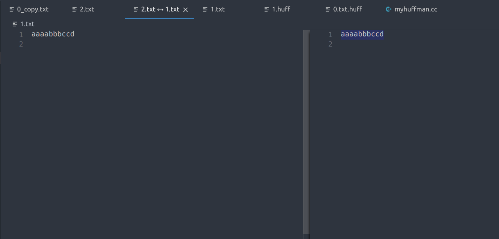
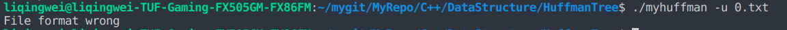
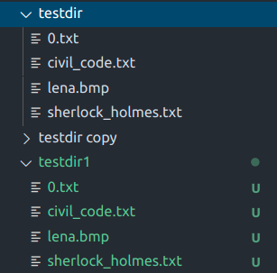

# 压缩程序与哈弗曼树

## 一、实验要求

实现这样一个程序,可以将指定路径的文件(txt,mp3,jpeg,pdf)压缩为以`` .huff`` 为后缀的压缩文件,
也可以将以`` .huff`` 为后缀的压缩文件解压成原始文件

### 基本设计

#### 压缩功能

统计文件中各个char出现的频率,按照书本上的算法构造huffman树,根据huffman树对原文件进行编
码,将huffman树和编码后的文件序列写入到`` .huff ``文件。

#### 解压功能

读出对应的huffman树信息,根据huffman树信息解码文件序列,将解码后的信息生成原始文件。

### 选做内容

(1)使用命令行参数argc与argv读取文件名

```
1 myhuffman hello.txt
2 //你将得到hello.txt.huff这个文件
```

(2)使用命令行参数 -z和 -u来区分压缩和解压,需要处理待解压的文件不是压缩文件这种异常情况,需打印一条错误信息然后退出程序即可。需要处理输入了异常的命令这种情况。

```
1 myhuffman -z hello.txt
2 //你将得到hello.txt.huff这个文件
3 myhuffman -u hello.txt.huff
4 //你将得到hello.txt这个文件
5 myhuffman -uz hello.txt
6 //提示错误信息后退出
7 myhuffman -u hello.txt
8 //提示错误信息后退出
```

(3)使用命令行参数 -r实现对运行得到的目标文件重命名

```
1 myhuffman -zr hello.txt 1.huff
2 myhuffman -u 1.huff
3 //解压刚才得到的 1.huff,你应得到hello.txt
```

(4)对文件夹进行压缩解压缩。

(5)使用优先队列构建Huffman树

(6)将Huffman编码以比特的形式而不是以ASCII的"01"形式存储。


## 二、设计思路

1. 对于压缩功能的实现，需要
   1. 哈弗曼树编码的函数
   2. 对读入文件的字符进行统计，得到权值函数，然后进行哈夫曼编码，最后输出到指定文件
2. 对于解压功能的实现，需要
   1. 从.huff文件中读取哈弗曼树的信息
   2. 重新构建哈弗曼树，然后从树的顶端按照读入的编码往下走得到叶子节点，输出相应字符
3. 选做内容(1)
   1. 只需要对输入的字符串进行拓展.huff后缀即可
4. 选做内容(2)
   1. 只需要对命令行参数进行相应操作即可
5. 选做内容(3)
   1. 通过对命令行参数的判断，将目标文件名传给压缩函数即可，压缩函数判断是加.huff还是重命名即可
   2. 在存完哈弗曼树的信息之后，还要存入源文件名的长度，源文件名的编码，源文件内容的编码
6. 选做内容(4)
   1. 对于文件夹的访问操作通过搜素引擎查找相关语法算法学习，结果是递归搜索读取
   2. 在压缩的时候，在存完哈弗曼树的信息之后，存入源文件名长度（包括文件夹），源文件名的编码（文件夹在末尾加上'/'以区分），源文件内容的大小，源文件内容的编码（如果是文件夹，就没有源文件内容的大小，源文件内容的编码）
   3. 解压的时候，首先读取完哈弗曼树的信息，然后读到源文件名的长度，接着根据长度得到源文件名，判断末尾是否为'/'，若是，则进行下一个文件的解压或者退出，如果不是，则读取源文件内容的大小，然后读取编码进行解压
7. 选做内容(5)
   1. 主要是在哈夫曼编码的函数中的Select（挑选最小的两个还没有parent的节点进行组合），在这里使用优先队列，把权值小的放前面，每次出队两次，然后得到新的节点，再把这个新的节点入队，这样原本出来的两个节点相当于有了parent
8. 选做内容(6)
   1. 这里主要就是对原来的01串的操作。通过unsigned char的左移加0加1的操作来将哈夫曼编码变成bit的形式。
   2. 主要是通过一个unsigned char变量bytes和一个记录当前已经填了bytes多少位的bitk来进行操作。如果bitk！=8，则bytes继续左移一位加0或加1，bitk++; 否则就输出，并且重新置0等待下一个bit的写入，bitk也变为0

### 各模块作用

```c++
//	myhuffman.cc

//  打印哈弗曼树的叶子节点个数，字符以及对应叶子节点的内容以及非叶子节点的内容
void PrintHuffmanTree(HuffmanTree T, int n, unsigned char chtable[], FILE *foutp);

//  统计source文件名的字符权重，然后如果source是文件，则统计文件的内容中的字符，若不然则直接返回
void Count(unsigned int w[], int &n, int *table, unsigned char chtable[MAX_CHARS], const char *source); //  记录文件中的字符个数

//  压缩
//  将source的压缩到dest中
//  细节
//  如果dest==NULL表示没有重命名，否则是重命名
//  w   为权值数组
//  n   为叶子节点个数
//  table   相当于某个字符对于的code编码串数组的下标的对应关系
//  chtable 反table对应关系
void Compress(HuffmanTree &T, unsigned int *w, HuffmanCode code, int &n, int *table, char *source, char *dest);

//  解压
//  ex_source即解压源
void Extract(HuffmanTree &HT, HuffmanCode &HC, int &n, char *ex_source);

//  递归读取文件夹
//  会根据path得到path下（包括path本身）的文件路径，同时会统计path下（包括path本身）的文件数量
int read_dir_r(char *path, char pathname[][MAX_CHARS], int &num_files);

//	HuffmanTree.h

typedef struct HTNode
{
    unsigned int i;     //  i为在HT中的编号
    unsigned int weight;//  权重
    unsigned int parent, lchild, rchild;    //  左右孩子双亲指针
}HTNode, * HuffmanTree;

typedef char ** HuffmanCode;

//  在下标<=i的范围内选择最小的两个没有parent的节点，通过s1,s2返回下标
void Select(HuffmanTree & HT, int i, int & s1, int & s2);

//  哈夫曼编码
//  n为叶子节点个数
void HuffmanDecoding(HuffmanTree & HT, HuffmanCode &HC, int &n);

//  权值比较函数
int cmp_weight(const HTNode & a, const HTNode & b);

//	priority_queue.h

//	初始化优先队列，入队，出队
    static void init(struct Priority_Queue &self, size_t capacity, int (*cmp)(const T &, const T &));
    static bool enqueue(struct Priority_Queue &self, const T &e);
    static bool dequeue(struct Priority_Queue &self, T &e);
```

## 三、关键代码讲解

1. 哈弗曼树的构造

```c++
    //  构造哈夫曼树
    HT_queue.init(HT_queue, m, cmp_weight);
    for (p = HT+1, i = 1; i <= n; i++, ++w, ++p)    //  先将叶子节点全部入队
    {
        *p = {(unsigned int)i, *w, 0, 0, 0};
        HT_queue.enqueue(HT_queue, *p);
    }
    
    for (i = n+1; i <= m; i++)  //  通过这么多此循环，将哈弗曼树的所有节点都构造出来
    {
        HTNode min1, min2;
        HT_queue.dequeue(HT_queue, min1);
        HT_queue.dequeue(HT_queue, min2);
        HT[i] = {(unsigned int)i, min1.weight+min2.weight, 0, min1.i, min2.i};  //  构造parent节点
        HT[min1.i].parent = (unsigned int)i;
        HT[min2.i].parent = (unsigned int)i;
        HT_queue.enqueue(HT_queue, HT[i]);
    }
```

2. 哈夫曼编码的构造

```c++
    //  构造哈夫曼编码
    //  从下往上构造
    HC = (HuffmanCode)malloc(sizeof(*HC)*(n+1));
    char * cd = (char *)malloc(n * sizeof(char));

    cd[n-1] = '\0';
    for (i = 1; i<=n; i++)
    {
        int start = n-1, f = HT[i].parent, c = i;

        for (; f != 0; c = f, f = HT[c].parent)
        {
            if (HT[f].lchild == c) cd[--start] = '0';   //  判断左右孩子来决定是加0还是加1
            else cd[--start] = '1';
        }

        HC[i] = (char *)malloc((n-start) * sizeof(char));
        strcpy(HC[i], cd+start);
    }
    free(cd);
```

3. 压缩

```c++
void Compress(HuffmanTree &T, unsigned int *w, HuffmanCode code, int &n, int *table, char *source, char *dest)
{
    int bitk = 0;
    unsigned char bytes = 0;
    unsigned char chtable[MAX_CHARS];
    char pathname[256][MAX_CHARS];
    int num_files = 0;

    //  递归读取source的信息，获取所有的pathname和文件个数
    read_dir_r(source, pathname, num_files); //  读取每个文件，包括文件夹的路径

    //  决定目标文件的名称
    int len_source = strlen(source);
    char *real_dest = (char *)malloc((len_source + 6) * sizeof(*real_dest));
    strcpy(real_dest, source);

    if (!dest) //  不是重命名
    {
        strcat(real_dest, ".huff");
    }
    else
    {
        strcpy(real_dest, dest);
    }

    n = 0;
    //  对每个pathname都进行相应的count操作
    for (int i = 0; i < num_files; i++)
    {
        Count(w, n, table, chtable, pathname[i]);
    }

    //  进行编码
    HuffmanCoding(T, code, w+1, n);

    FILE *foutp = fopen(real_dest, "wb");

    //  打印哈夫曼树的信息
    PrintHuffmanTree(T, n, chtable, foutp);

    int len_pathname = 0;

    //  对每个pathname进行打印信息
    for (int i = 0; i < num_files; i++)
    {
        len_pathname = strlen(pathname[i]);
        int table_path;

        //  打印pathname的路径长度
        fwrite(&len_pathname, sizeof(int), 1, foutp); //  在解压时读入需要加1，因为还有一个\0

        //  打印路径
        for (int j = 0; j < len_pathname; j++)
        {
            table_path = table[pathname[i][j]];
            for (int k = 0; k < strlen(code[table_path]); k++)  //  进行bit的填写
            {
                bytes <<= 1;
                bytes += code[table_path][k] - '0';
                ++bitk;
                if (bitk == 8)
                {
                    fwrite(&bytes, sizeof(unsigned char), 1, foutp);
                    bytes = 0;
                    bitk = 0;
                }
            }
        }
        while (bitk != 8 && bitk != 0)  //  如果没有填写完，就将后面的位都置0
        {
            bytes <<= 1;
            ++bitk;
        }
        if (bitk == 8)
            fwrite(&bytes, sizeof(unsigned char), 1, foutp); //  处理剩余部分

        bytes = 0;
        bitk = 0;
        if (pathname[i][strlen(pathname[i]) - 1] != '/')    //  如果是文件，就打印文件内容的信息
        {
            FILE *fp = fopen(pathname[i], "rb");
            fseek(fp, 0L, SEEK_END);
            long flen = ftell(fp);
            fseek(fp, 0L, SEEK_SET);

            //  打印文件内容大小
            fwrite(&flen, sizeof(long), 1, foutp);

            unsigned char u_ch;
            while (!feof(fp) && fread(&u_ch, sizeof(unsigned char), 1, fp)) //  打印文件内容
            {
                for (int i = 0; i < strlen(code[table[u_ch]]); i++)
                {
                    bytes <<= 1;
                    bytes += code[table[u_ch]][i] - '0';
                    ++bitk;
                    if (bitk == 8)
                    {
                        fwrite(&bytes, sizeof(unsigned char), 1, foutp);
                        bytes = 0;
                        bitk = 0;
                    }
                }
            }
            while (bitk != 8 && bitk != 0)
            {
                bytes <<= 1;
                ++bitk;
            }
            if (bitk == 8)
                fwrite(&bytes, sizeof(unsigned char), 1, foutp); //  处理剩余部分
            bytes = 0;
            bitk = 0;
            fclose(fp);
        }
        else    //  文件夹没有操作
        {
        }
    }
    fclose(foutp);
    return;
}
```

4. count函数

```c++
void Count(unsigned int w[MAX_CHARS], int &n, int *table, unsigned char chtable[MAX_CHARS], const char *source)
{
    int len_source = strlen(source);
    for (int i = 0; i < len_source; i++) //  给源文件名统计字符
    {
        if (table[source[i]] == 0)  //  没有这个字符
        {
            n++;
            table[source[i]] = n;
            w[table[source[i]]]++;
            chtable[n] = source[i];
        }
        else    //  有这个字符
        {
            w[table[source[i]]]++;
        }
    }
    if (source[strlen(source) - 1] == '/')
        return; //  文件夹不需要读内容
    FILE *fp = fopen(source, "rb");
    if (fp == nullptr)
        printf("error while open file");
    // FILE *fout = fopen(dest, "wb");
    unsigned char u_ch;
    while (!feof(fp) && fread(&u_ch, sizeof(unsigned char), 1, fp)) //  给源文件统计字符
    {
        // fwrite(&u_ch, sizeof(unsigned char), 1, fout); //  复制一遍文件
        if (table[u_ch] == 0)
        {
            n++;
            table[u_ch] = n;
            w[table[u_ch]]++;
            chtable[n] = u_ch;
        }
        else
        {
            w[table[u_ch]]++;
        }
    }
    fclose(fp);
}
```

4. 解压函数

```c++
void Extract(HuffmanTree &HT, HuffmanCode &HC, int &n, char *ex_source)
{
    char ex_dest[MAX_CHARS];
    int len_ex_source = strlen(ex_source);
    if (len_ex_source <= 5) //  判断输入文件的后缀是否为.huff
        printf("File format wrong\n");
    else if (strcmp(ex_source + len_ex_source - 5, ".huff") != 0)
        printf("File format wrong\n");
    else
    {
        FILE *fin = fopen(ex_source, "rb");
        fscanf(fin, "%d", &n);
        int m = 2 * n - 1;
        int i = 1;
        unsigned char chtable[MAX_CHARS];
        //  读取哈弗曼树
        HT = (HuffmanTree)malloc(sizeof(*HT) * (m + 1));
        for (i = 1; i <= n; i++)
        {
            char ch = fgetc(fin);
            fscanf(fin, "%hhu%u%u%u%u", &chtable[i], &HT[i].weight, &HT[i].parent, &HT[i].lchild, &HT[i].rchild);
        }
        for (; i <= m; i++)
        {
            fgetc(fin);
            fscanf(fin, "%u%u%u%u", &HT[i].weight, &HT[i].parent, &HT[i].lchild, &HT[i].rchild);
        }

        fgetc(fin); //  读取换行

        i = m;
        char ch;
        unsigned char u_ch;
        int j = 0;   //  ex_dest[j]
        char bit[8]; //  存放读入字节的每一位，7为MSB
        while (!feof(fin))
        {
            //  读取文件名长度
            int len_pathname;
            fread(&len_pathname, sizeof(int), 1, fin);
            if (feof(fin))
                break;
            int path_i = 0;
            i = m;
            while (path_i < len_pathname) //  读文件名
            {
                fread(&u_ch, sizeof(unsigned char), 1, fin);
                for (int k = 0; k < 8; k++) //  对字节进行分解，得到bit数组
                {
                    bit[k] = u_ch % 2;
                    u_ch /= 2;
                }
                for (int k = 7; k >= 0; k--)    //  由bit数组的高位到低位进行哈夫曼树的自顶向下的寻找
                {
                    if (bit[k] == 0)
                    {
                        i = HT[i].lchild;
                    }
                    else
                    {
                        i = HT[i].rchild;
                    }
                    if (HT[i].lchild == 0 && HT[i].rchild == 0)
                    {
                        u_ch = chtable[i];
                        ex_dest[path_i] = u_ch;
                        path_i++;
                        if (path_i == len_pathname)
                            break;
                        i = m;
                    }
                }
            }

            //  得到文件名之后的判断
            ex_dest[path_i] = '\0';
            if (ex_dest[strlen(ex_dest) - 1] == '/')    //  文件夹就需要创建文件夹
            {
                mkdir(ex_dest, S_IRWXU | S_IRWXG | S_IROTH | S_IXOTH);
            }
            else    //  文件
            {
                FILE *foutp = fopen(ex_dest, "wb");
                i = m;
                long flen;
                
                //  读取文件内容大小
                fread(&flen, sizeof(long), 1, fin);
                long f_i = 0;
                while (f_i < flen)  //  文件内容的解压,与上类似
                {
                    fread(&u_ch, sizeof(unsigned char), 1, fin);
                    for (int k = 0; k < 8; k++)
                    {
                        bit[k] = u_ch % 2;
                        u_ch /= 2;
                    }
                    for (int k = 7; k >= 0; k--)
                    {
                        if (bit[k] == 0)
                        {
                            i = HT[i].lchild;
                        }
                        else
                        {
                            i = HT[i].rchild;
                        }
                        if (HT[i].lchild == 0 && HT[i].rchild == 0)
                        {
                            u_ch = chtable[i];
                            fwrite(&u_ch, sizeof(unsigned char), 1, foutp);
                            f_i++;
                            if (f_i == flen)
                                break;
                            i = m;
                        }
                    }
                }
                fclose(foutp);
            }
        }
        fclose(fin);
    }
}
```

5. 递归读取文件夹

```c++
int read_dir_r(char *path, char pathname[][MAX_CHARS], int &num_files)
{
    DIR *dp = nullptr;
    struct dirent *st;
    struct stat sta;
    int ret = 0;
    char tmp_name[1024] = {0};
    dp = opendir(path);
    if (dp == nullptr)  //  文件
    {
        strcpy(pathname[num_files], path);
        num_files++;
        return 0;
    }
    else    //  文件夹
    {
        strcpy(tmp_name, path);
        if (path[strlen(path) - 1] != '/')
            strcat(tmp_name, "/");
        strcpy(pathname[num_files], tmp_name);
        num_files++;
    }

    while (1)   //  读取文件夹下的文件,然后递归调用
    {
        st = readdir(dp);
        if (st == nullptr)
        {
            break;
        }

        strcpy(tmp_name, path);
        if (path[strlen(path) - 1] != '/')
            strcat(tmp_name, "/");
        strcat(tmp_name, st->d_name);
        ret = stat(tmp_name, &sta);
        if (ret < 0)
        {
            printf("read stat fail\n");
            return -1;
        }

        if (S_ISDIR(sta.st_mode))   //  读取到文件夹
        {
            if (strcmp(".", st->d_name) == 0 || strcmp("..", st->d_name) == 0)
                continue;
            else
            {
                read_dir_r(tmp_name, pathname, num_files);
            }
        }
        else    //  读取到文件
        {
            strcpy(pathname[num_files], tmp_name);
            num_files++;
        }
    }
    closedir(dp);
    return 0;
}

```

## 四、调试分析

在压缩时，会对几乎所有文件读取两遍，需要O(2n)的时间

需要table，chtable等映射辅助空间,还有Huffman树，Huffman编码的辅助空间，权值函数w的辅助空间，pathname存放路径的辅助空间

解压时，扫完.huff文件即可，时间为O(n)

需要哈弗曼树和哈夫曼编码的辅助空间

##	五、代码测试

1. 压缩



得到效果








2. 解压


为演示方便，0.txt.huff得到的0.txt被手动重命名为1.txt，1.huff解压得到的0.txt文件重命名为2.txt



3. 错误信息




4. 文件夹


这里手动在第一条命令结束后将testdir重命名为testdir1，方便比较

解压后的结果



5. 解压效果

   testdir原本的大小大约为1.2M


压缩后


## 实验总结

1. 通过哈夫曼编码实现对文件的压缩
2. 学会了对文件夹的相关操作
3. 了解到二进制文件的字符范围是0~255，读入需要用unsigned char读入
4. 学会对01ASCII串的二进制转换处理方式

