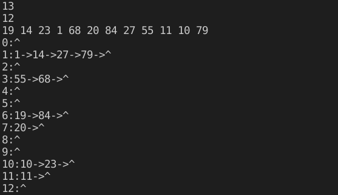

## 9.19

散列地址|0|1|2|3|4|5|6|7|8|9|10|
:--:|:--:|:--:|:--:|:--:|:--:|:--:|:--:|:--:|:--:|:--:|:--:|
关键字|22|30 |41| 1|13 |53|46| | | |67

key|次数
:--:|:--:|
22|1
41|1
53|1
46|1
30|2
13|3
1|1
67|2
$ASL(8)=\frac{1}{8}(1\times5+2\times2+3)=1.5$

## 9.45

```c++
typedef int KeyType;

typedef struct HashNode //  链上节点
{
    KeyType key;
    struct HashNode *next;
} HashNode, *HashTable;

void CreateHashTable(HashTable *table);

int H(KeyType x, int m);

void Insert(HashTable head, KeyType key);

void Print(HashTable *table, int m);

int main(void)
{
    HashTable *table;
    CreateHashTable(table);
    return 0;
}

void CreateHashTable(HashTable *table)
{
    int i = 0;
    int m = 0;
    scanf("%d", &m);    //  Hash表长度

    table = (HashTable *)malloc(sizeof(*table) * m);    //  包含m个指针的指针数组
    for (i = 0; i < m; i++)
    {
        table[i] = (HashTable)malloc(sizeof(*table[i]));    //  每个位置对应的头结点
        table[i]->next = nullptr;
    }

    int num = 0;
    scanf("%d", &num);  //  关键字序列个数
    KeyType *key_in = (KeyType *)malloc(sizeof(*key_in) * num);
    for (i = 0; i < num; i++)
    {
        scanf("%d", &key_in[i]);
        Insert(table[H(key_in[i], m)], key_in[i]);      //  插入key，在H(key)得到的相应的链表中
    }
    Print(table, m);
}

int H(KeyType x, int m)
{
    return x % m;
}

void Insert(HashTable head, KeyType key) //  这里head是多出来的那个头结点，不是有数据的头结点
{
    HashTable p = head->next;
    HashTable p_pre = head;
    while (p != nullptr)
    {
        if (p->key > key)   //  p_pre->key <= key && p->key > key
            break;
        else
        {
            p_pre = p;
            p = p->next;
        }
    }
    HashTable new_p = (HashTable)malloc(sizeof(*new_p));
    new_p->key = key;
    new_p->next = p;
    p_pre->next = new_p;
}

void Print(HashTable *table, int m)
{
    int i = 0;
    for (i = 0; i < m; i++)
    {
        printf("%d ", i);
        HashTable p = table[i]->next;
        while (p != nullptr)
        {
            printf("%d ", p->key);
            p = p->next;
        }
        putchar('\n');
    }
}

```

*   书上例子结果


