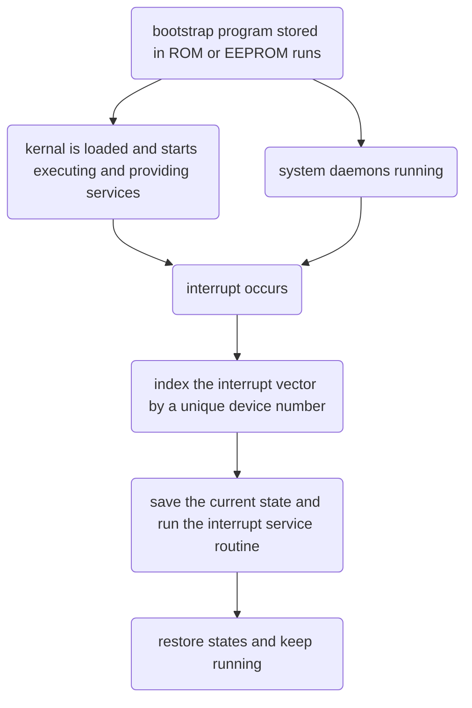

# Operating System Concepts

## Chapter1

* operating system - an intermediary between the computer user and the hardware. 
* it's also a resource allocator

### how does a computer start running

### 1.2.3 I/O Structure

more than one device can be attached depending on the controller.

a device controller maintains some local buffer storage and a set of special-purpose registers.

operating systems have a device driver for each device controller.

a device driver understands the device controller and provides the rest of the operating system with a uniform interface to the device

*   I/O operation
    1.  device driver loads appropriate registers within the device controller
    2.  device controller examines the contents of these registers to determine what to do
    3.  device controller starts tranferring data from the device to the local buffer
    4.  device controller informs the device driver via an interrupt
    5.  device driver returns controll to the operating system, returning data, pointers, or other status information

>   this works fine for small amounts of data movement

*   for bulk data movement, direct memory access(DMA) is used
    1.  setting up buffers, pointersm, counters for the I/O device
    2.  device controller transfers an entire block of data

### 1.3 Computer-System Architecture

a system with only one general-purpose CPU is a single-processor system

multiprocessor system(parallel system, multicore system)

*   two types
    1.  asymmetric multiprocessing
    2.  symmetric multiprocessing

>   very difficult to memorize some new concepts

### 1.4 Operating-System Structure

I don't know anything!!!

### 1.5 Operating-System Operations

