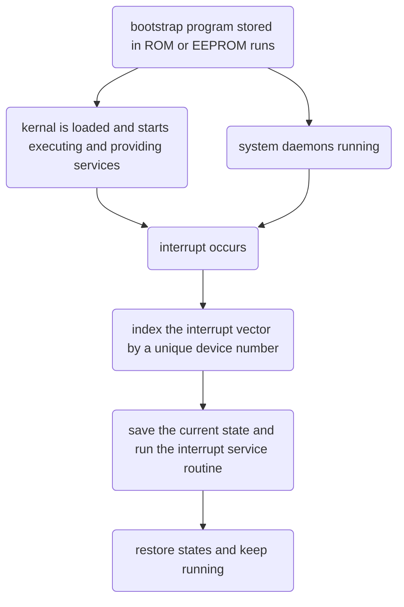

# Operating System Concepts

## Chapter1

* operating system - an intermediary between the computer user and the hardware. 
* it's also a resource allocator

### how does a computer start running

```mermaid
graph TD

A(bootstrap program stored in ROM or EEPROM runs) --> B(kernal is loaded and starts executing and providing services)
A-->C(system daemons running)
B-->D(interrupt occurs)
C-->D
D-->E(index the interrupt vector by a unique device number)
E-->F(save the current state and run the interrupt service routine)
F-->G(restore states and keep running)


```

