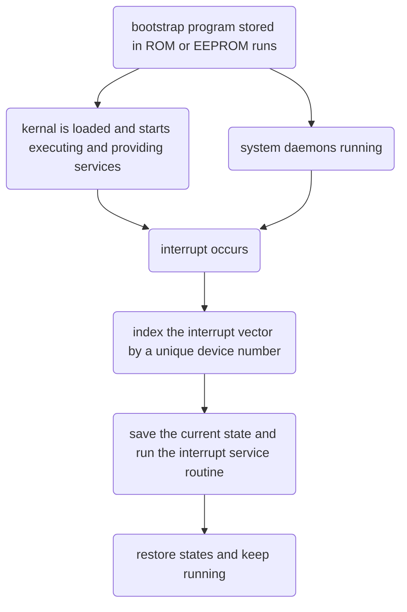

# Operating System Concepts

## Chapter1

* operating system - an intermediary between the computer user and the hardware. 
* it's also a resource allocator

### how does a computer start running

### 1.2.3 I/O Structure

more than one device can be attached depending on the controller.

a device controller maintains some local buffer storage and a set of special-purpose registers.

operating systems have a device driver for each device controller.

a device driver understands the device controller and provides the rest of the operating system with a uniform interface to the device

*   I/O operation
    1.  device driver loads appropriate registers within the device controller
    2.  device controller examines the contents of these registers to determine what to do
    3.  device controller starts tranferring data from the device to the local buffer
    4.  device controller informs the device driver via an interrupt
    5.  device driver returns controll to the operating system, returning data, pointers, or other status information

>   this works fine for small amounts of data movement

*   for bulk data movement, direct memory access(DMA) is used
    1.  setting up buffers, pointersm, counters for the I/O device
    2.  device controller transfers an entire block of data

### 1.3 Computer-System Architecture

a system with only one general-purpose CPU is a single-processor system

multiprocessor system(parallel system, multicore system)

*   two types
    1.  asymmetric multiprocessing
    2.  symmetric multiprocessing

>   very difficult to memorize some new concepts

### 1.4 Operating-System Structure

I don't know anything!!!

### 1.5 Operating-System Operations

nothing

##  Chapter2

# Part 2 Process Management

Process---the unit of work in most systems

operating system processes---system code

user processes---user code

responsibilities of the operating systems:

1.  creation and deletion of user and system processes
2.  scheduling of processes
3.  provide mechanisms for syncronization, communications and deadlock handling

## Chapter3

### Process Scheduling

#### context switch

1.  when interrupt occurs, save the current context(in PCB) of the process to suspend the process and then resume it
2.  state save & state restore
3.  context switch: a state save of the current process and a state restore of a different process

### Operations on Processes

mechanisms in creating processes & process creation on Unix and Windows systems

#### Process Creation

1.  a unique process identifier(pid, int) to identify processes
2.  ``init``(pid 1) serves as the root parent process of all user processes
3.  ``kthreadd`` creates additional processes that perform tasks on behalf of the kernel
4.  ``sshd`` manages clients that connect to the system by ``ssh``
5.  ``login`` manages clients that directly log onto the system
6.  child process obtain its resources(CPU time, memory, I/O devices) from the os, or the subset of resources of its parent
7.  parent process may partition its resources or share resources among its children
8.  parent process may pass along initialization data and output device
9.  when a process creates a new process
    1.  execution
        1.  parent execute with its children
        2.  parent waits until some of its children have terminated
    2.  address-space
        1.  child process is a copy of the parent
        2.  ... a new program
10. 

